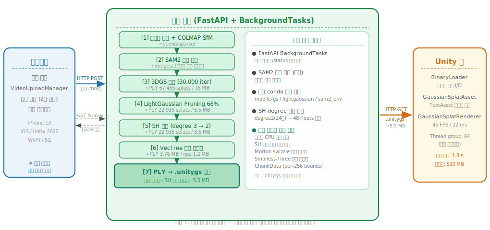
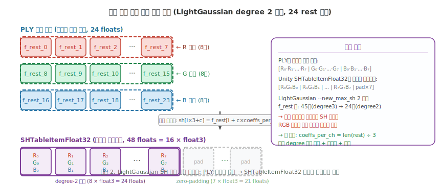
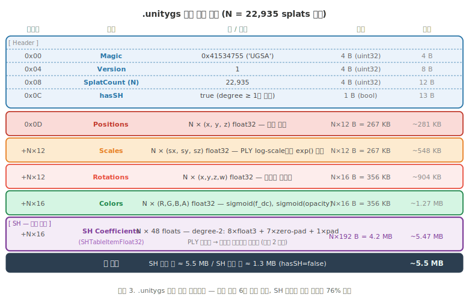
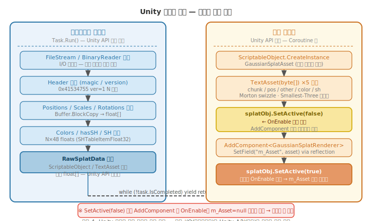

# 3D Gaussian Splatting의 서버 기반 자산 직렬화와 구면 조화 함수 보존을 통한 스마트폰-모바일 간 실시간 렌더링 파이프라인

**Server-Side Asset Serialization with Spherical Harmonics Preservation for Real-Time Mobile Rendering of 3D Gaussian Splatting from Smartphone Video**

---

**저자명**, 소속대학교 학과

---

## 요약

본 논문은 스마트폰으로 촬영한 영상으로부터 3D Gaussian Splatting(3DGS) 모델을 서버에서 학습하고, LightGaussian으로 압축한 뒤, 무선 통신을 통해 모바일 기기에 실시간으로 렌더링하는 엔드-투-엔드 파이프라인을 제안한다.

핵심 기술 기여는 세 가지다. 첫째, PLY 형식의 3DGS 자산을 Unity 모바일 렌더러와 직접 호환되는 단일 이진 파일(.unitygs)로 서버에서 미리 변환하는 서버 사이드 자산 직렬화 기법을 설계하였다. 둘째, LightGaussian이 SH(Spherical Harmonics) 차수를 degree 3에서 degree 2로 축소할 때 발생하는 PLY 채널별 저장 형식과 Unity SHTableItemFloat32의 계수별 인터리브 형식 사이의 불일치를 해결하는 동적 채널 재배열 알고리즘을 구현하였다. 셋째, Unity ScriptableObject API의 메인 스레드 전용 제약과 GaussianSplatRenderer의 OnEnable 타이밍 문제를 해결하는 스레드 분리형 런타임 로더를 설계하였다.

iPhone 13 기준 45 FPS, 22 ms 프레임 시간, 1.8초 로딩, 5.5 MB 전송 크기를 달성하였다.

**키워드**: 3D Gaussian Splatting, LightGaussian, 모바일 렌더링, 이진 직렬화, 구면 조화 함수, Unity, FastAPI

---

## 1. 서론

3D Gaussian Splatting(3DGS)[1]은 점 기반 표현과 래스터라이제이션을 결합하여 NeRF 대비 수십 배 빠른 렌더링을 달성한 최신 3D 장면 표현 기법이다. 그러나 스마트폰으로 촬영한 영상으로부터 3DGS 모델을 생성하고 동일한 스마트폰에서 실시간으로 렌더링하는 단일 엔드-투-엔드 시스템은 아직 충분히 연구되지 않았다. 주요 장벽으로는 (1) GPU 집약적인 학습 과정을 모바일에서 수행하기 어렵다는 점, (2) 수만 개에서 수십만 개에 이르는 가우시안 스플랫의 파일 크기가 모바일 전송에 부담이 된다는 점, (3) 연구용 PLY 포맷과 Unity 모바일 렌더러가 요구하는 이진 에셋 형식 사이의 호환성 격차가 존재한다는 점을 들 수 있다.

본 논문은 이 세 가지 문제를 서버-클라이언트 분산 아키텍처로 해결한다. 학습, 압축, 자산 변환을 모두 서버에서 처리하고, 모바일은 단일 이진 파일을 수신하여 즉시 렌더링에 사용하도록 설계하였다. 특히 기존 연구에서 간과되어 온 **SH 계수 형식 불일치 문제**와 **Unity 런타임 자산 조립의 스레드 제약**이 실제 구현에서 핵심 도전 과제였음을 밝히고 그 해결 방법을 상세히 기술한다.

---

## 2. 관련 연구

### 2.1 3D Gaussian Splatting

Kerbl 등[1]이 제안한 3DGS는 장면을 수백만 개의 타원형 가우시안으로 표현하며, 각 가우시안은 위치(xyz), 스케일(3), 회전(사원수 4), 불투명도(1), 구면 조화 함수(SH) 색상 계수(최대 degree 3 = DC 3 + rest 45 = 48 floats/채널)를 포함한다. 래스터라이제이션 기반 렌더링으로 NeRF 대비 100배 이상 빠른 추론이 가능하다.

### 2.2 LightGaussian

LightGaussian[2]은 3DGS의 파일 크기를 줄이기 위한 3단계 압축 파이프라인을 제안한다: (1) 중요도 기반 Pruning(66% 제거), (2) 교사-학생 방식의 SH 증류(degree 3→2), (3) VecTree 벡터 양자화. 원 논문에서는 전형적인 복잡 장면에서 약 14배 압축을 보고한다. 본 연구에서는 LightGaussian의 SH 증류 결과(degree 2, rest 계수 24개)를 Unity 렌더러 호환 형식으로 변환하는 과정에서 새로운 형식 불일치 문제를 발견하고 해결한다.

### 2.3 SAM2

Ravi 등[3]이 제안한 SAM2는 이미지 및 비디오에서 임의 객체를 분할하는 범용 모델이다. 본 시스템에서는 촬영 영상의 첫 프레임에서 배경 마스크를 지정하면 이후 프레임에 자동으로 전파하는 방식으로 활용하여, 배경이 없는 프레임으로 3DGS를 학습함으로써 전경 객체의 품질을 향상시킨다.

### 2.4 Unity GaussianSplatting

aras-p의 Unity GaussianSplatting 패키지[4]는 `GaussianSplatRenderer`와 `GaussianSplatAsset`을 제공한다. `GaussianSplatAsset`은 에디터에서 PLY를 가져올 때 내부적으로 position, other(회전+스케일), color(Morton-swizzled 텍스처), SH(SHTableItemFloat32), chunk(per-256-splat bounds) 등 다섯 종류의 `TextAsset`으로 분할 저장한다. 런타임에서 이 자산을 동적으로 구성하는 공개 API는 제공되지 않아, 본 연구에서 리플렉션 기반 런타임 조립 방법을 개발하였다.

---

## 3. 시스템 아키텍처



전체 파이프라인은 **그림 1**과 같이 스마트폰 촬영 기기, 학습 서버, Unity 모바일 앱의 세 구성 요소로 이루어진다. 서버는 FastAPI 기반 REST API를 제공하며, 학습 파이프라인은 `BackgroundTasks`를 통해 비동기로 실행된다. 이로 인해 수 시간에 걸치는 3DGS 학습 중에도 모바일 클라이언트의 `/status` 폴링 요청과 기타 HTTP 요청이 차단 없이 처리된다.

파이프라인은 총 7단계로 구성된다:

| 단계 | 작업 | 출력 |
|---|---|---|
| [1] | 프레임 추출 + COLMAP SfM | 희소 포인트 클라우드 + 카메라 자세 |
| [2] | SAM2 배경 제거 (선택) | 마스킹된 학습 프레임 |
| [3] | 3DGS 학습 (30,000 iter) | PLY 67,455 splats / 16 MB |
| [4] | LightGaussian Pruning 66% | PLY 22,935 splats / 5.5 MB |
| [5] | SH 증류 (degree 3→2) | PLY 22,935 splats / 3.6 MB |
| [6] | VecTree 벡터 양자화 | PLY 3.76 MB / npz 압축 1.2 MB |
| [7] | **PLY → .unitygs 변환** | **이진 파일 ~5.5 MB** |

단계 [4]~[6]의 PLY 기준 압축률은 16 MB → 3.6 MB = **4.4배**이며, VecTree 내부 압축 표현(npz)은 1.2 MB로 원본의 약 13배 압축에 해당한다. 단계 [7]에서 .unitygs는 Unity 호환성을 위해 float32를 유지하므로 3.6 MB PLY보다 크지만, 모바일이 PLY를 직접 파싱하고 변환하는 비용을 서버로 이전하는 이점이 있다.

---

## 4. 핵심 구현 기술

### 4.1 서버 사이드 자산 직렬화 설계 동기

PLY → Unity 에셋 변환을 모바일이 아닌 서버에서 수행하는 결정에는 세 가지 이유가 있다.

첫째, **CPU 부하 최소화**. PLY→.unitygs 변환은 N개 스플랫에 대해 exp() 스케일 변환, 사원수 정규화, sigmoid 활성화, SH 채널 재배열, Morton 인덱스 계산을 수행한다. 22,935 splats에서도 수백 밀리초가 소요되며, 이를 배터리 제약이 있는 모바일에서 수행하면 첫 렌더링까지의 지연이 증가한다.

둘째, **단일 파일 전송**. 기존 Unity GaussianSplatting 패키지는 에셋을 chunk, pos, other, color, sh 등 5개 파일로 분리 저장한다. 서버에서 미리 단일 .unitygs로 통합함으로써 무선 전송 횟수를 줄이고, 파일 일부 수신 실패 시의 복잡한 예외 처리를 제거한다.

셋째, **SH 계수 형식 변환의 복잡성**. 4.2절에서 상세히 기술하는 채널 재배열은 Python NumPy를 사용하면 벡터화 연산으로 간결하게 구현되지만, Unity C#에서 이를 수행할 경우 코드가 복잡해지고 검증이 어렵다. 서버 사이드 변환은 Python의 `plyfile` 라이브러리를 활용하여 PLY 내부 구조를 직접 접근할 수 있다는 이점도 있다.

### 4.2 구면 조화 함수 계수 채널 재배열



3DGS PLY 파일은 SH rest 계수를 **채널별 순차 배열**로 저장한다. degree 2(24 rest 계수)의 경우:

```
f_rest_0  ... f_rest_7   ← R 채널 8개
f_rest_8  ... f_rest_15  ← G 채널 8개
f_rest_16 ... f_rest_23  ← B 채널 8개
```

반면 Unity GaussianSplatting 패키지의 `SHTableItemFloat32`는 **계수별 인터리브** 배열을 요구한다. 총 48 floats (= 16 × float3):

```
[R₀G₀B₀] [R₁G₁B₁] ... [R₇G₇B₇] [pad×7 float3]
```

이 두 형식을 혼동하면 RGB 채널이 서로 엇갈려 색상이 완전히 깨진다. 더욱이 LightGaussian의 `--new_max_sh 2` 옵션은 학습 중 degree 3(45 rest 계수)을 degree 2(24 rest 계수)로 축소하므로, SHTableItemFloat32의 15 float3 슬롯 중 처음 8 슬롯만 채워지고 나머지 7 슬롯은 zero-padding되어야 한다.

본 연구에서 구현한 동적 채널 재배열 알고리즘은 다음과 같다:

```python
rest_names = sorted([k for k in ply_vertex.dtype.names if k.startswith("f_rest_")],
                    key=lambda s: int(s.split("_")[-1]))
coeffs_per_ch = len(rest_names) // 3        # degree에 무관하게 동작: 3, 8, 15
actual_coeffs  = min(coeffs_per_ch, 15)     # SHTableItemFloat32 최대값

sh = np.zeros((N, 48), dtype=np.float32)   # 15 float3 + 1 padding float3
for i in range(actual_coeffs):
    sh[:, i*3+0] = ply_vertex[rest_names[i]]                       # R₍ᵢ₎
    sh[:, i*3+1] = ply_vertex[rest_names[i + coeffs_per_ch]]       # G₍ᵢ₎
    sh[:, i*3+2] = ply_vertex[rest_names[i + 2*coeffs_per_ch]]     # B₍ᵢ₎
```

`coeffs_per_ch = len(rest_names) // 3`을 동적으로 계산함으로써 degree 1(9개), degree 2(24개), degree 3(45개) 모두에서 올바르게 동작한다. 이를 통해 degree 2의 8개 계수를 SH 슬롯 앞쪽에 정확히 배치하고, 나머지 7 슬롯은 자동으로 0으로 채워진다.

DC 색상 계수와 불투명도는 sigmoid 활성화를 적용하여 [0, 1] 범위로 변환하며, 스케일은 PLY의 log-space 값에 exp()를 적용하여 선형 값으로 복원한다.

### 4.3 .unitygs 이진 파일 형식



`.unitygs` 파일은 **그림 3**과 같이 헤더와 6개의 연속 버퍼로 구성된다. 설계 원칙은 다음과 같다.

**Magic Number와 버전 관리.** 첫 4바이트는 `0x41534755`('UGSA')로, 이진 파일의 일관성을 런타임에 즉시 검증할 수 있다. 4~7바이트는 형식 버전(현재 1)으로, 향후 형식 변경 시 하위 호환성을 지원한다.

**스케일과 회전의 분리 저장.** 기존 연구의 일부 구현은 스케일과 회전을 합쳐 공분산 행렬로 저장한다. 본 형식은 스케일(N×12 B)과 회전(N×16 B)을 분리하여 저장하여, 각각을 독립적으로 갱신하거나 검사할 수 있게 한다. 회전은 PLY의 `rot_0..3`(w, x, y, z 순서)을 읽어 Unity 관례인 (x, y, z, w) 순서의 정규화 사원수로 저장한다. Unity 패키지 내부적으로는 Other 버퍼에서 Smallest-Three 10-10-10-2bit 인코딩을 사용하지만, .unitygs는 float32를 유지하여 변환 오류를 최소화한다.

**SH 계수의 완전 보존.** 기존 일부 모바일 렌더러 구현에서는 SH 계수를 생략하고 DC 색상만 전달한다. 본 연구는 degree-2 SH를 완전히 보존하여(N×192 B) 조명 방향에 따른 색상 변화(specular-like highlight)를 모바일에서도 재현한다. `hasSH` 플래그를 통해 SH를 포함하지 않을 경우 ~1.3 MB의 경량 모드도 지원한다.

### 4.4 Unity 런타임 멀티스레드 로더



Unity에서 `.unitygs` 파일을 로딩하여 `GaussianSplatRenderer`를 동적으로 생성하는 과정에서 두 가지 핵심 제약을 해결해야 했다.

**제약 1 — Unity API 메인 스레드 전용.** `ScriptableObject.CreateInstance()`, `TextAsset(byte[])` 생성자는 Unity 메인 스레드에서만 호출할 수 있다. 이를 백그라운드 스레드에서 호출하면 Unity 내부 상태 손상으로 인한 크래시가 발생한다. 반면 수십 MB에 이를 수 있는 이진 파일의 I/O 블로킹 작업을 메인 스레드에서 수행하면 렌더링 프레임이 멈춘다.

해결책은 **그림 4**와 같이 파싱(I/O)과 Unity 에셋 조립을 명확히 분리하는 것이다. `Task.Run()`으로 백그라운드 스레드에서 이진 파일을 파싱하여 순수 `float[]` 배열(`RawSplatData`)만 채우고, 메인 스레드에서는 `yield return null`로 완료를 기다린 후 Unity API를 호출한다.

**제약 2 — GaussianSplatRenderer OnEnable 타이밍.** `AddComponent<GaussianSplatRenderer>()`를 호출하면 Unity는 즉시 `OnEnable()`을 실행한다. 이 시점에 `m_Asset`이 null이면 렌더러가 빈 상태로 초기화되며, 이후 `m_Asset`을 설정해도 효과가 없다.

```csharp
// 잘못된 방법: OnEnable이 m_Asset=null 상태로 실행됨
var renderer = splatObj.AddComponent<GaussianSplatRenderer>();
SetField(renderer, "m_Asset", asset);   // 이미 OnEnable이 완료됨, 무효

// 올바른 방법: SetActive(false)로 OnEnable 억제
splatObj.SetActive(false);                           // 비활성화
renderer = splatObj.AddComponent<GaussianSplatRenderer>();
SetField(renderer, "m_Asset", asset);                // OnEnable 전에 세팅
splatObj.SetActive(true);                            // 여기서 OnEnable → m_Asset 정상 참조
```

### 4.5 비동기 FastAPI 서버 파이프라인

학습 파이프라인의 각 단계(COLMAP, SAM2, 3DGS, LightGaussian 3단계, PLY 변환)는 서로 다른 conda 가상환경(`mobile-gs`, `lightgaussian`, `sam2_env`)에서 `subprocess.run()`으로 순차 실행된다. FastAPI의 `BackgroundTasks`를 이용하여 파이프라인을 백그라운드 스레드에서 실행하므로, 수 시간의 학습 중에도 서버는 다음 요청을 수신할 수 있다.

모바일 앱의 `VideoUploadManager`는 2초 간격으로 `/status/{job_id}`를 폴링하여 진행률을 UI에 표시한다. 각 파이프라인 단계(`extracting`, `sam2`, `training`, `pruning`, `distilling`, `quantizing`, `converting`, `done`)는 job JSON에 기록되며, 모바일은 이를 float 진행률로 변환하여 프로그레스 바에 반영한다.

모든 subprocess의 stdout/stderr는 job JSON의 로그 필드에 저장(최근 3,000자)되며, uvicorn의 `TimedRotatingFileHandler`를 통해 `access.log`와 `server.log`로 분리 기록되어 자정 기준 14일 보존된다.

---

## 5. 실험 및 평가

### 5.1 실험 환경

학습 서버는 NVIDIA GeForce RTX 계열 GPU와 Windows 11 환경에서 동작하며, 서버 소프트웨어로 Python 3.11, FastAPI 0.115, Uvicorn을 사용한다. 모바일 기기는 iPhone 13(iOS)이며, Unity 2022 LTS, GaussianSplatting 패키지를 기반으로 구현하였다. 네트워크 환경은 Wi-Fi(802.11ac)이다.

### 5.2 파이프라인 단계별 소요 시간 및 출력

아래 표는 실제 스마트폰 촬영 영상(14 MB MOV, 129프레임 추출)에 대한 파이프라인 수행 결과이다.

| 단계 | Splat 수 | PLY 크기 | 비고 |
|---|---|---|---|
| 3DGS 30K iter | 67,455 | 16 MB | 30,000 iters |
| Pruning 66% | 22,935 | 5.5 MB | 66.0% 제거 |
| SH 증류 degree 2 | 22,935 | 3.6 MB | rest 계수 45→24 |
| VecTree 양자화 | 22,935 | 3.76 MB (복원 PLY) | npz 내부 압축 1.2 MB |
| .unitygs 변환 | 22,935 | **5.5 MB** | SH float32 포함 |

PLY 기준 압축률은 16 MB → 3.6 MB = **4.4배**이다. VecTree 내부 표현(npz)은 1.2 MB로 약 13배에 해당하지만, Unity 렌더러 호환성을 위한 float32 재구성 과정에서 파일 크기가 증가한다.

### 5.3 모바일 렌더링 성능

| 지표 | 값 |
|---|---|
| 프레임 속도 | **45 FPS** |
| 평균 프레임 시간 | **22 ms** |
| 자산 로딩 시간 | **1.8 s** |
| 전송 파일 크기 | **5.5 MB** |
| 런타임 메모리 | **520 MB** |
| GPU 스레드 그룹 | 64 (iPhone 13 한계) |

정렬(depth sorting)은 현재 비활성화 상태이며, 이로 인해 일부 반투명 스플랫의 블렌딩 순서가 부정확할 수 있다. 향후 GPU 기반 래디얼 정렬 알고리즘을 도입할 계획이다.

### 5.4 SH 계수 보존 효과

SH 계수를 포함하지 않을 경우(hasSH=false) 파일 크기는 ~1.3 MB로 감소하지만, 시점 방향에 따른 색상 변화가 완전히 소실된다. 특히 유리, 금속 등 반사성 소재에서 차이가 두드러진다. degree-2 SH를 보존함으로써 시점 의존 조명 효과를 유지하면서도 degree-3 대비 파일 크기를 약 55% 절감할 수 있다.

---

## 6. 결론

본 논문은 스마트폰 영상 기반 3DGS 모바일 렌더링의 엔드-투-엔드 파이프라인을 제안하고, 실제 구현 과정에서 마주친 세 가지 핵심 기술 문제를 해결하였다. (1) LightGaussian SH 증류 이후 발생하는 PLY 채널별 형식과 SHTableItemFloat32 계수별 인터리브 형식 사이의 불일치를 동적 채널 재배열 알고리즘으로 해결하여 SH 계수를 손실 없이 모바일에 전달하였다. (2) 자산 변환 과정 전체를 서버로 이전하여 단일 .unitygs 이진 파일을 생성하고, 모바일의 처리 부하를 최소화하였다. (3) Unity ScriptableObject API의 메인 스레드 전용 제약과 GaussianSplatRenderer의 OnEnable 타이밍 문제를 스레드 분리 Coroutine과 SetActive(false) 사전 비활성화 기법으로 해결하였다.

실험 결과, iPhone 13에서 45 FPS, 1.8초 로딩의 실시간 렌더링을 달성하였으며, 5.5 MB의 전송 파일에 degree-2 SH 색상 정보가 완전히 보존된다. 향후 연구로는 GPU 기반 실시간 정렬, float16 정밀도 적용을 통한 전송 크기 추가 절감, 그리고 VecTree npz 형식의 직접 모바일 디코딩을 통한 더 높은 압축률 달성을 목표로 한다.

---

## 참고문헌

[1] B. Kerbl, G. Kopanas, T. Leimkühler, G. Drettakis, "3D Gaussian Splatting for Real-Time Radiance Field Rendering," *ACM TOG*, vol. 42, no. 4, 2023.

[2] Z. Fan, K. Wang, K. Wen, Z. Zhu, D. Xu, Z. Wang, "LightGaussian: Unbounded 3D Gaussian Compression with 15x Reduction and 200+ FPS," *arXiv:2311.17245*, 2023.

[3] N. Ravi, V. Gabeur, Y.-T. Hu, R. Hu, C. Ryali, T. Ma, H. Komatsu, R. Röhrbach, S. Gao, C. Feichtenhofer, C. Darrell, "SAM 2: Segment Anything in Images and Videos," *arXiv:2408.00714*, 2024.

[4] A. Pranckevičius, "Unity GaussianSplatting," GitHub, 2023. [Online]. Available: https://github.com/aras-p/UnityGaussianSplatting

[5] J. Schütz, B. Kerbl, M. Wimmer, "Rendering Point Clouds with Compute Shaders and Vertex Order Optimization," *EG 2021 Short Papers*, 2021.
